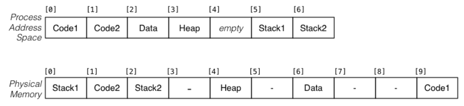

### Consider a process whose address space is partitioned into 4KB pages (that's 0x1000 bytes) and the pages are distributed across physical memory.

The process address space starts at 0 (0x0) [start of Code1] and ends at 28761(0x6fff), [end of Stack2].

For each of the following process addresses, determine what physical address it maps to.

- jal func, where the label func is at 5096 (0x13e8):
0x13e8
- lw $s0,($sp), where $sp contains 28668 (0x6ffc): 
0x2ffc
- la $t0, msg, where the label msg is at 10192 (0x27d0): 0x67d0

| Page number | Frame number |
|-------------|--------------|
|  0x0        |    0x9       |
|  0x1        |    0x1       |
|  0x6        |    0x2       |
|  0x2        |    0x6       |
