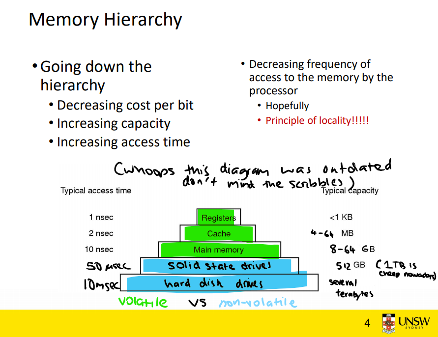

# Virtual memory

**Poll**: How are you feeling about virtual memory?

### Memory hierarchy


### Cool things virtual memory lets us do
- swapping to a 'backing store'
- not need contiguous free memory
- process/kernel isolation
- shared object libraries

#### Non-contiguous allocation?

Here's some physical memory. What if I want to load another process requiring three 'blocks' of memory?
```
   +------+------+------+------+------+------+
   |      |      | USED | USED | USED |      |
   +------+------+------+------+------+------+
```
- could shift but...

### Some things to consider
- addressing in machine code (such as MIPS) operates on actual addresses
    - we have to do this, since we don't know where in physical memory our program will get loaded
- we use virtual addressing
    - we have hardware to translate a process' view of virtual memory to actual memory

### When might we not need virtual memory?
- embedded systems
    - example: 

### Pages and frames
- **Pages** are 
- **Frames** are
- segments??
- Page/frame sizes are often a power of 2 - this allows us to perform bitwise operations to speed things up.

#### Page tables
**Page tables** map ...

**Inverted page tables** are an operating system construct which map ... This will be important for this week's lab!

### Q7 - What is the difference between a virtual address and physical address?
A virtual address is ...

### What tends to happen when we access a virtual address which isn't in our address space?
...

### Let's say that hypothetically page/frame sizes were 4096 bytes each - how would we map virtual address to physical addresses?
...

### Q5 - Each new process in a computer system will have its own address space. Which parts of the address space contain initial values at the point when the process starts running? Which parts of the address space can be modified as the process executes?
- Code
- Data
    - rodata
    - Global variables
    - Dynamic data
- Stack

### Q3 - Assume we have 6 virtual memory pages and 4 physical memory pages and are using a least-recently-used (LRU) replacement strategy.

See `lru_example.md`.

### Let's take a look at the starter code for this week's lab!
See `lru.c`.

```
$ dcc lru.c -o lru
$ ./lru
Simulating 4 pages of physical memory, 6 pages of virtual memory
5
Time 0: virtual page 5 loaded to physical page 0
3
Time 1: virtual page 3 loaded to physical page 1
5
Time 2: virtual page 5 -> physical page 0
3
Time 3: virtual page 3 -> physical page 1
0
Time 4: virtual page 0 loaded to physical page 2
1
Time 5: virtual page 1 loaded to physical page 3
2
Time 6: virtual page 2  - virtual page 5 evicted - loaded to physical page 0
2
Time 7: virtual page 2 -> physical page 0
3
Time 8: virtual page 3 -> physical page 1
5
Time 9: virtual page 5  - virtual page 0 evicted - loaded to physical page 2
```

### Q6 - One possible (and quite old) approach to loading programs into memory is to load the entire program address space into a single contiguous chunk of RAM, but not necessarily at location 0.
See `contiguous.md`.

### Q8 - Consider a process whose address space is partitioned into 4KB pages and the pages are distributed across physical memory.
See `paged_proc.md`.

### Q9 - Working sets and page faults
