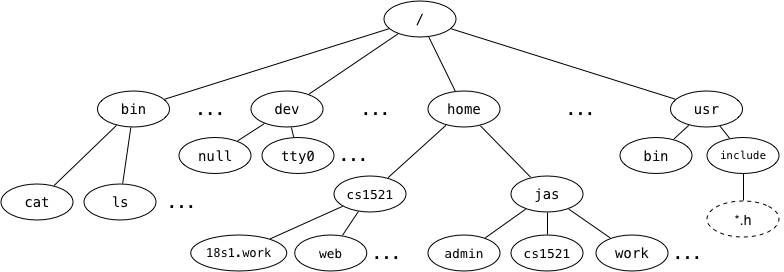

# Q2: File system structure

We say that the Unix filesystem is tree-structured, with the directory called / as the root of the tree.

### What is the full pathname of COMP1521's web directory?

### Which directory is ~jas/../..?

### Links to the children of a given directory are stored as entries in the directory structure. Where is the link to the **parent** directory stored?

### What kind of filesystem object is cat?

### What kind of filesystem object is home?

### What kind of filesystem object is tty0?

### What kind of filesystem object is a symbolic link? What value does it contain?

### Symbolic links change the filesystem from a tree structure to a graph structure. How do they do this?
